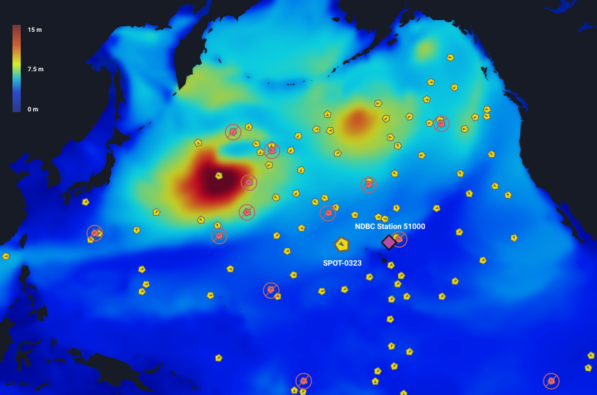
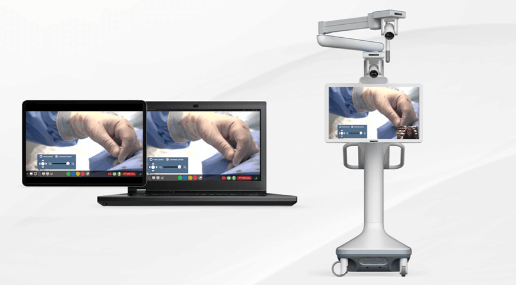

# portfolio

Over the span of 7 years, I have worked at four companies.
Two large corporations: Kaiser Permanente and Oracle.
Two startups: Sofar Ocean and Avail Medsystems.

Both types were equally enjoyable with differing workloads.
Large Corporations provided job security and a concentrated niche in a large scale project.
Startups provided full autonomy, self-learning, and ownership of one's work.

In this README, I will outline the overview of some of the projects that I worked on.
DISCLAIMER: This is just an overview, no outline of code will be provided.

## Sofar Ocean Dashboard

#### Technologies: React.js, Redux, Material UI, D3.js

During my time at Sofar Ocean, I was the Lead Frontend Engineer.
The main product? Spotter.

Placed in the ocean, the sensors collected and transmited wave, wind, sea surface temperature, and barometric pressure data in real-time.
This data was then sent over a satellite connection to the Cloud.

With that data, I create a dashboard that displayed the `last location` of the Spotter.
I was also able to extract the `wave height` (through calculation), `wave direction`, `wind speed` and `wind direction`.

Using `D3.js`, I animated the weather conditions over the area of the Spotters.

There was also a graph table that showed +-3 days that would show the recorded data from previous three days and the project data for next three days.

References: Co-Founder and CTO

## Avail Medsystems

#### Technologies: React.js, Redux, Material UI, Swift, Electron

Over 3.5 years at Avail, I wore multiple hats.
Eventually taking on the role of the Technical Lead, I managed 5 projects.

Avail's main product? `Remote Collaboration`

Scenario: Given our main Console in the operating room in Seattle, End Users (assisting Doctors) could sit at their computers in LA or Texas to oversee and assist real time.

I worked on the Remote Clients:

- the Browser
- the Console's Electron interface
- the Console's Swift Application

Also, the proprietary PubNub / Twilio library as well.

We created a new interface from Scratch, using React.js, Redux, Material UI, etc.
This allowed for better User Experience and significantly faster Runtime.

Handled a lot of tech debt, refactoring, and squashed bugs like no tomorrow!

References: Manager, VP Engineering, Colleagues
